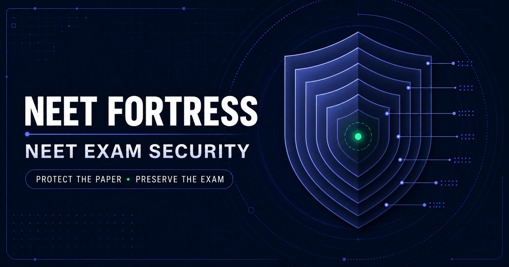
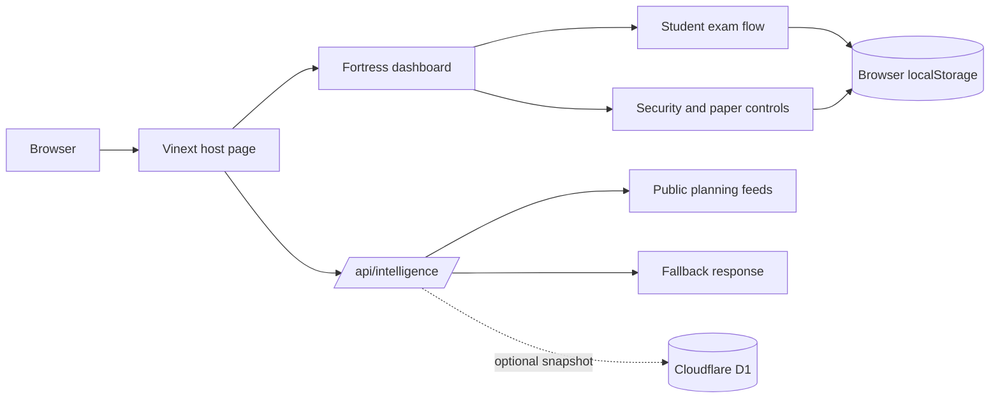

# NEET Fortress



**Protect the paper. Preserve the exam.**

NEET Fortress is an early-stage exam security and operations prototype focused on protecting NEET question banks and exam papers. It brings paper assembly, local access signals, audit views, and student practice flows into one browser interface.

> **Project status:** Prototype. The security views are demonstrations, not a guarantee that an exam paper cannot be leaked. The included questions are generated sample content and must be replaced with reviewed material before educational use.

## What it includes

| Area | Current capability |
| --- | --- |
| NEET PaperGuard | Security overview, local event feed, recommendations, and system status |
| Student hub | Full 180-question mock exams and 20-question focused practice |
| Exam runner | Timer, answer selection, question palette, mark-for-review, resume after reload, and submit flow |
| Results | NEET-style marking (+4 / −1 / 0), subject breakdown, accuracy, and answer review |
| QuestionVault | Search, add questions, import/export JSON, subject summaries, and demo question set |
| PaperShield | Randomized paper candidates assembled from the available question bank |
| PaperGuard monitoring | Optional browser camera/microphone signals for motion, light, and sound |
| NEET Lock | Local administrator setup and unlock demonstration |
| Audit and Sentinel | Local event-chain demonstration and simulated anomaly summaries |
| Intelligence API | `/api/intelligence` fetches public planning signals when available and returns a fallback payload otherwise |

Camera and microphone access is optional. Students can enter the app and use the exam flow without granting either permission.

## Project map

```text
app/                         Vinext host page, metadata, and API routes
  api/intelligence/          Public planning and telemetry endpoint
  chatgpt-auth.ts            Optional Sign in with ChatGPT helpers
db/                          Drizzle schema and optional D1 access
drizzle/                     Existing SQL migration artifacts
public/neet-fortress-banner.png  README/social preview artwork
public/fortress/              Main browser dashboard and its modules
  index.html                  Interface and screen structure
  app.js                      Navigation, rendering, and event wiring
  learning.js                 Exam state, scoring, and browser persistence
  questions.js                Generated sample question bank
  engine.js                   Randomized paper assembly
  monitoring.js               Consent-based local media signal processing
  security.js, dsa.js          Local audit and cryptographic demonstrations
tests/                        Rendered page and browser-module checks
worker/index.ts               Cloudflare Worker entry point
```

### How the current app is wired



Student attempts and administrator-added questions currently stay in that browser's `localStorage`. The student exam flow does not yet use D1, user accounts, or server-side exam timing.

## Run it locally

### Requirements

- Node.js `>=22.13.0`
- npm

### Start the development server

```bash
npm install
npm run dev
```

Open the local URL printed by Vinext. The dashboard is served at `/fortress/index.html` inside the host page.

### Available commands

```bash
npm run dev          # Start local development
npm run build        # Create a production build
npm start            # Serve the production build
npm test             # Build and run the rendered HTML checks
npm run lint         # Run ESLint
npm run db:generate  # Generate Drizzle migrations from schema changes
```

## Question bank format

The question editor imports JSON in either of these forms:

```json
{
  "questions": [
    {
      "id": "PHY-001",
      "subject": "Physics",
      "chapter": "Laws of Motion",
      "text": "A sample question goes here.",
      "options": ["Option A", "Option B", "Option C", "Option D"],
      "answer": 0,
      "difficulty": 2,
      "explanation": "Explanation shown during answer review."
    }
  ]
}
```

The root can also be the question array itself. `answer` is a zero-based option index (`0` through `3`). Subjects must be `Physics`, `Chemistry`, `Botany`, or `Zoology`. The question editor can export the currently loaded bank as JSON.

## Data and security boundaries

- The built-in 924-question bank is generated demonstration content; questions and answers may be repetitive or inaccurate.
- Student names, attempts, and custom questions are saved only in the current browser. They do not sync across devices and can be removed when browser storage is cleared.
- The local administrator passphrase and several security state views are prototype-only; they do not provide production identity or authorization.
- Media monitoring starts only after an explicit administrator action. Browser frames/audio are analyzed for basic environmental signals; this is not identity verification and cannot prove misconduct.
- Paper shuffling, Sentinel scores, and the audit view demonstrate interface concepts. They do not guarantee confidentiality, prevent exfiltration, or replace a security review.
- `.openai/hosting.json` currently has no D1 binding configured. The optional D1/Drizzle foundation is not used to save student attempts or the question bank.

## Before a real deployment

1. Replace the generated set with an accurately sourced, reviewed question bank and explanations.
2. Add authenticated student/admin roles and server-side authorization.
3. Configure D1 and move question, paper, attempt, and audit data behind server APIs.
4. Enforce exam timing and answer submission on the server; add backups and operational monitoring.
5. Review privacy, consent, data retention, accessibility, and security requirements for the intended exam setting.

The existing ChatGPT sign-in helper is available in `app/chatgpt-auth.ts`, but it is not connected to the student dashboard or an authorization policy.

## Stack

- React 19 and Vinext
- Vite and Cloudflare Workers tooling
- Drizzle ORM with optional Cloudflare D1
- Standalone HTML/CSS/JavaScript dashboard under `public/fortress/`

## Product names

**NEET Fortress** is the platform. The project uses **NEET PaperGuard** for the security command center, **PaperGuard** for optional access monitoring, **QuestionVault** for the question bank, **PaperShield** for paper assembly, and **NEET Lock** for admin controls. **ExamVault** is reserved for a future protected paper storage and release workflow; it is not implemented yet. These names describe intended product areas, not guarantees that papers cannot be leaked.
